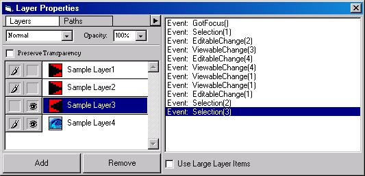



## VBLayers2 \- New Photoshop\-esque Layers Dialog

### Description

Completely rewritten. Add an Adobe Photoshop styled layers dialog to your application. Please refer the the screenshot to see this control in action. Supports realtime layer dragging, visibility and editability toggles, full thumnail support and much more. Any feedback and/or votes would be most appreciated.
 
### More Info
 

             |
---                |---
**Submitted On**   |2004-03-13 08:21:56
**By**             |[Joseph M\. Ferris](https://github.com/Planet-Source-Code/PSCIndex/blob/master/ByAuthor/joseph-m-ferris.md)
**Level**          |Advanced
**User Rating**    |5.0 (25 globes from 5 users)
**Compatibility**  |VB 5\.0, VB 6\.0
**Category**       |[Custom Controls/ Forms/  Menus](https://github.com/Planet-Source-Code/PSCIndex/blob/master/ByCategory/custom-controls-forms-menus__1-4.md)
**World**          |[Visual Basic](https://github.com/Planet-Source-Code/PSCIndex/blob/master/ByWorld/visual-basic.md)
**Archive File**   |[VBLayers2\_1719603132004\.zip](https://github.com/Planet-Source-Code/joseph-m-ferris-vblayers2-new-photoshop-esque-layers-dialog__1-52267/archive/master.zip)

